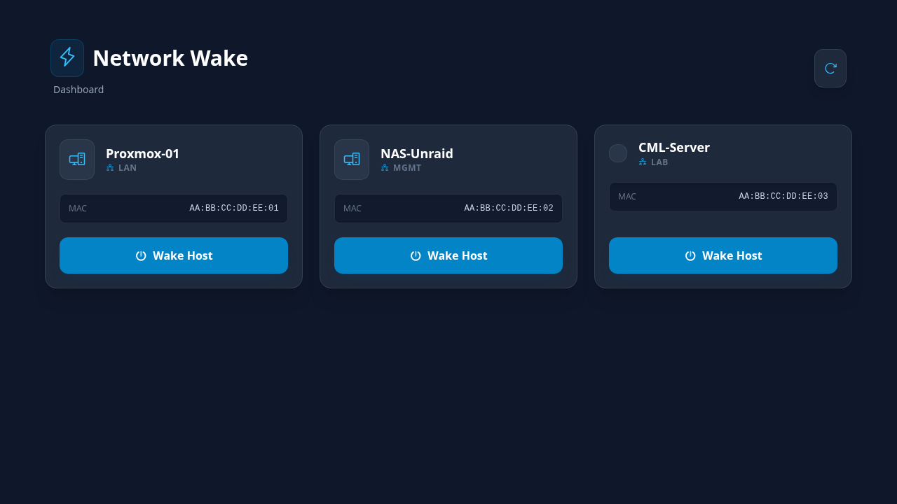

# OPNsense WOL v3



A lightweight web dashboard for waking devices on your network through the OPNsense WOL plugin API. v3 replaces ping-based status checks with OPNsense ARP table lookups — no `HOST_IPS` or `INTERFACE_MAP` needed. Built with Express.js and Tailwind CSS.

## What's New in v3

- **ARP-Based Status** — Host online/offline is determined directly from the OPNsense ARP table (MAC-level presence). No IP mapping, no ping, no firewall rules.
- **No INTERFACE_MAP** — Friendly interface names (e.g. "HSD", "SVRS") come directly from the OPNsense WOL API's `%interface` field — no manual mapping.
- **No HOST_IPS** — Status works automatically for every WOL host, no IP configuration required.
- **Parallel Data Loading** — Host list and ARP status fetch concurrently for faster page loads.
- **Status Embedded in Hosts** — Online indicators are part of `/api/hosts` response — no separate `/api/status` call.
- **Minimal Privileges** — Only 3 OPNsense API privileges needed: **WOL**, **Diagnostics: ARP Table**.

## Features

| Feature | Description |
|---|---|
|| **Host Discovery** | Fetches all WOL-configured hosts directly from OPNsense |
|| **One-Click Wake** | Sends magic packet via OPNsense API with toast confirmation |
|| **Wake All** | One-click button wakes every host at once |
|| **Host Status** | Real-time online indicators via OPNsense ARP table — MAC-level presence, no ping needed |
|| **Theme Selector** | 5 preset color themes with localStorage persistence |
|| **Wake History** | Tracks when each host was last woken |
|| **Responsive Grid** | Card-based layout adapts from 1 to 3 columns |
|| **Auto-Refresh** | Polls OPNsense and refreshes status every 30 seconds |
|| **Sanitized Display** | Host descriptions and MAC addresses are HTML-escaped |
|| **Dockerized** | Production Docker build with Alpine Node.js |
|| **CI/CD** | Gitea Actions workflow builds and deploys on version tags |

## How It Works

```
┌──────────┐     ┌───────────────────┐     ┌──────────────────────────────┐
│  Browser │────►│  Express Server   │────►│  OPNsense API                │
│ (UI)     │     │  (Node.js)        │     │                              │
└──────────┘     └───────────────────┘     │  GET /api/diagnostics/       │
                       │                    │    interface/get_arp          │
                   GET /api/hosts           │    ─► status + IP            │
                   POST /api/wake/:uuid     │                              │
                   POST /api/wake-all       │  POST /api/wol/wol/          │
                                            │    searchHost / set          │
                                            └──────────────────────────────┘
```

The Express server acts as a bridge between the browser and OPNsense:

1. **List hosts** — queries OPNsense `wol/searchHost`, fetches ARP table in parallel, merges status + IP per MAC
2. **Wake host** — sends magic packet via OPNsense `wol/set`
3. **Status** — embedded in `/api/hosts` response via the ARP lookup — no separate status endpoint

## Getting Started

### Prerequisites
- Node.js 18+
- OPNsense with the **os-wol** plugin installed and API access enabled
- OPNsense API key with these privileges:
  - **WOL** — required for `wol/searchHost` and `wol/set` endpoints
  - **Diagnostics: ARP Table** — required for `diagnostics/interface/get_arp` (host status checks)
- Docker (optional, for containerized deployment)

### OPNsense API Permissions

When creating the API key in OPNsense (System → Access → Users → edit user → API keys), assign these privileges:

| Privilege | Endpoint | Purpose |
|---|---|---|
| **WOL** | `/api/wol/wol/*` | List and wake hosts |
| **Diagnostics: ARP Table** | `/api/diagnostics/interface/get_arp` | Check host online status |

That's it — no "All Pages" or other privileges needed.

### Configuration

The server is configured entirely through environment variables:

| Variable | Required | Default | Description |
|---|---|---|---|
| `OPNSENSE_URL` | ✅ | — | OPNsense base URL (e.g. `https://opnsense.lan`) |
| `OPNSENSE_API_KEY` | ✅ | — | OPNsense API key |
| `OPNSENSE_API_SECRET` | ✅ | — | OPNsense API secret |
| `PORT` | ❌ | `3000` | Server listen port |
| `VERIFY_SSL` | ❌ | `false` | Set to `"true"` to verify SSL cert |
| `DEMO_MODE` | ❌ | `false` | Set to `"true"` to run with mock data — no OPNsense needed |

> **Note on v2 → v3:** `HOST_IPS`, `INTERFACE_MAP`, and the separate `/api/status` endpoint are removed. Status and interface names come directly from OPNsense ARP + WOL APIs.

### Demo Mode

Set `DEMO_MODE=true` to run a fully functional dashboard with 6 mock hosts (3 online, 3 offline) — no OPNsense connection required. Status is simulated using the ARP-response style baked into the demo data:

```sh
DEMO_MODE=true node server.js
# → http://localhost:3000
```

### Development

```sh
git clone https://git.twk95.com/twk95/opnsense-wol.git
cd opnsense-wol
npm install

OPNSENSE_URL=https://opnsense.lan \
OPNSENSE_API_KEY=your-key \
OPNSENSE_API_SECRET=your-secret \
node server.js
```

Open `http://localhost:3000` to view the dashboard. Hosts will show online/offline status automatically via ARP.

### Docker

```sh
# Build and run
docker build -t opnsense-wol .
docker run -d -p 3000:3000 -e DEMO_MODE=true opnsense-wol
```

### Docker Compose

```sh
# Run in demo mode (no OPNsense required)
docker compose up -d

# Run with real OPNsense (edit docker-compose.yml first)
OPNSENSE_URL=https://opnsense.lan \
OPNSENSE_API_KEY=*** \
OPNSENSE_API_SECRET=*** \
docker compose up -d
```

Or edit `docker-compose.yml` directly to set environment variables for production.

> **Note:** Status is determined via OPNsense's ARP table (API), not ICMP — no special network config or host mode needed.

### Demo (no OPNsense required)

```sh
docker run -d -p 3000:3000 -e DEMO_MODE=true opnsense-wol
# → http://localhost:3000
```

## API Endpoints

| Method | Path | Description |
|---|---|---|
| `GET` | `/api/hosts` | List all WOL hosts from OPNsense with ARP-based online status + IP |
| `POST` | `/api/wake/:uuid` | Send wake signal to a host by UUID |
| `POST` | `/api/wake-all` | Send wake signal to all configured hosts |
| `GET` | `/health` | Health check endpoint |

## Themes

Click the theme dropdown in the header to switch between 5 color presets:

| Theme | Vibe |
|---|---|
| **Slate Dark** | Default — cool blue-grey |
| **Emerald Dark** | Deep green |
| **Violet Dark** | Indigo/purple |
| **Rose Dark** | Warm red |
| **Light** | Clean white |

Your choice persists in localStorage across sessions.

## Project Structure

```
├── server.js            # Express server (API proxy + ARP-based status)
├── public/
│   └── index.html       # Frontend (Tailwind CSS via CDN, themes, wake history)
├── Dockerfile           # Production build (Alpine Node.js)
├── docker-compose.yml   # One-command demo or production deployment
├── .env.example         # Environment variable template
├── .dockerignore
├── package.json
└── .gitea/workflows/    # CI/CD (Docker build + deploy on v* tags)
```

## License

ISC
