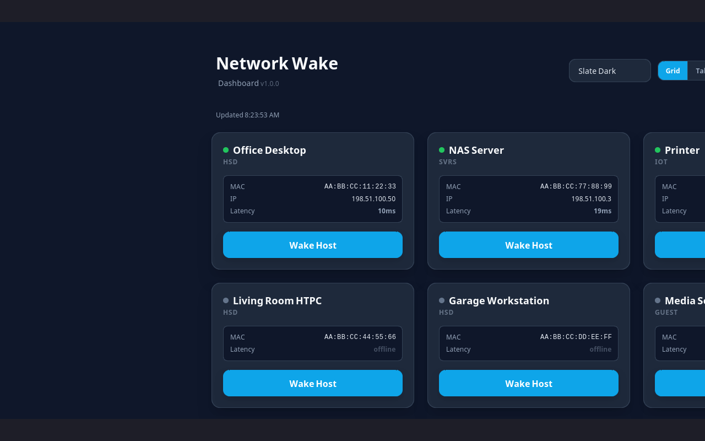
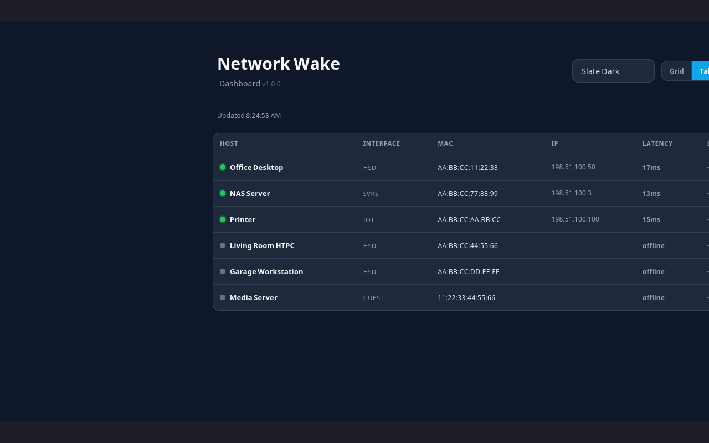

# OPNsense WOL

 *Grid view* |  *Table view*

A lightweight web dashboard for waking devices on your network through the OPNsense WOL plugin API. Features live ping latency (RTT), a compact table/grid view toggle, and ARP-based host status. Built with Express.js.

> 🌐 **Live Demo:** [https://wol-demo.twk95.com/](https://wol-demo.twk95.com/) — Fully functional dashboard with mock hosts, no OPNsense required.

## Security

> ⚠️ **This app has no built-in authentication.** Every API endpoint — including `/api/wake/*` (which sends magic packets) — is open to anyone who can reach the server. For production use, deploy **exclusively behind a reverse proxy** (OPNsense HAProxy, Nginx, Caddy, etc.) with authentication. The app is designed to run on a trusted LAN or VPN.

## Features

| Feature | Description |
|---|---|
| | **Host Discovery** | Fetches all WOL-configured hosts directly from OPNsense |
| | **One-Click Wake** | Sends magic packet via OPNsense API with toast confirmation |
| | **Wake All** | One-click button wakes every host at once |
| | **Host Status** | Real-time online indicators via OPNsense ARP table — MAC-level presence, no ping needed |
| | **Ping Latency (RTT)** | Live round-trip time display with color-coded badges (60s cache) |
| | **Table/Grid View** | Toggle between compact card grid and sortable data table — preference persisted in localStorage |
| | **Theme Selector** | 5 preset color themes with localStorage persistence |
| | **Wake History** | Tracks when each host was last woken |
| | **Responsive Design** | Card layout adapts from 1 to 3 columns; table view is scrollable on mobile |
| | **Auto-Refresh** | Polls OPNsense and refreshes status every 30 seconds; RTT re-fetches every 30s |
| | **Scheduled Wake** | Schedule automatic wake-ups by time and day-of-week |
| | **Sanitized Display** | Host descriptions and MAC addresses are HTML-escaped |
| | **Dockerized** | Production Docker build with Alpine Node.js |

## How It Works

```
┌──────────┐     ┌───────────────────┐     ┌──────────────────────────────┐
│  Browser │────►│  Express Server   │────►│  OPNsense API                │
│ (UI)     │     │  (Node.js)        │     │                              │
└──────────┘     └───────────────────┘     │  GET /api/diagnostics/       │
                       │                    │    interface/get_arp          │
                   GET /api/hosts           │    ─► status + IP            │
                   POST /api/wake/:uuid     │                              │
                   POST /api/wake-all       │  POST /api/wol/wol/          │
                   GET  /api/ping/:uuid     │    searchHost / set          │
                   GET  /api/ping           └──────────────────────────────┘
                   GET  /api/schedules
                   POST /api/schedules
```

The Express server acts as a bridge between the browser and OPNsense:

1. **List hosts** — queries OPNsense `wol/searchHost`, fetches ARP table in parallel, merges status + IP per MAC
2. **Wake host** — sends magic packet via OPNsense `wol/set`
3. **Status** — embedded in `/api/hosts` response via the ARP lookup — no separate status endpoint
4. **Ping latency** — system `ping` to each host's IP, cached in memory for 60 seconds
5. **Scheduled wake** — in-process scheduler checks enabled schedules every 60 seconds and fires wake requests

## Getting Started

### Prerequisites
- [Docker](https://docs.docker.com/engine/install/) & [Docker Compose](https://docs.docker.com/compose/install/)
- OPNsense with the **os-wol** plugin installed and API access enabled
- OPNsense API key with the **WOL** privilege (`wol/searchHost` and `wol/set`)

### OPNsense API Permissions

When creating the API key in OPNsense (System → Access → Users → edit user → API keys), assign these privileges:

| Privilege | Endpoint | Purpose |
|---|---|---|
| **WOL** | `/api/wol/wol/*` | List, wake hosts, and check status via ARP table |

That's it — just one privilege needed.

### Configuration

The server is configured entirely through environment variables:

| Variable | Required | Default | Description |
|---|---|---|---|
| `OPNSENSE_URL` | ✅ | — | OPNsense base URL (e.g. `https://opnsense.lan`) |
| `OPNSENSE_API_KEY` | ✅ | — | OPNsense API key |
| `OPNSENSE_API_SECRET` | ✅ | — | OPNsense API secret |
| `PORT` | ❌ | `3000` | Server listen port |
| `VERIFY_SSL` | ❌ | `false` | Set to `"true"` to verify SSL cert |
| `DEMO_MODE` | ❌ | `false` | Set to `"true"` to run with mock data — no OPNsense needed |
| `DATA_DIR` | ❌ | `./data` | Directory for persistent data (schedules, wake history) |

### Demo Mode

Run a fully functional dashboard with 6 mock hosts (3 online, 3 offline) — no OPNsense connection required:

```sh
docker run -d -p 3000:3000 -e DEMO_MODE=true opnsense-wol
# → http://localhost:3000
```

Or use [Docker Compose](#docker-compose) with `DEMO_MODE: "true"`. RTT is simulated with random values (5–20ms) for online hosts in demo mode.

### Docker

```sh
# Build and run
docker build -t opnsense-wol .
docker run -d -p 3000:3000 -e DEMO_MODE=true opnsense-wol
```

### Docker Compose

The fastest way to run — drop this in as `docker-compose.yml`:

```yaml
services:
  opnsense-wol:
    image: opnsense-wol
    build: .
    container_name: opnsense-wol
    restart: unless-stopped
    ports:
      - "3000:3000"
    environment:
      # ── Demo mode (no OPNsense required) ──
      DEMO_MODE: "true"

      # ── Production: uncomment and fill in your OPNsense API credentials ──
      # OPNSENSE_URL: "https://opnsense.lan"
      # OPNSENSE_API_KEY: "your-api-key"
      # OPNSENSE_API_SECRET: "your-api-secret"

      # ── Optional ──
      # PORT: "3000"
      # DATA_DIR: "/data"
      # VERIFY_SSL: "false"
    volumes:
      - wol_data:/data

volumes:
  wol_data:
```

For **production**, uncomment the OPNsense credentials and set `DEMO_MODE: "false"`.

> **Note:** Status is determined via OPNsense's ARP table (API), not ICMP — no special network config or host mode needed.

## API Endpoints

| Method | Path | Description |
|---|---|---|
| `GET` | `/api/hosts` | List all WOL hosts with ARP-based online status + IP |
| `GET` | `/api/ping/:uuid` | Ping a single host by UUID, returns RTT in ms (60s cache) |
| `GET` | `/api/ping` | Batch ping — returns cached RTT for all hosts |
| `POST` | `/api/wake/:uuid` | Send wake signal to a host by UUID |
| `POST` | `/api/wake-all` | Send wake signal to all configured hosts |
| `GET` | `/api/schedules` | List all scheduled wake tasks |
| `POST` | `/api/schedules` | Create a scheduled wake |
| `PUT` | `/api/schedules/:id` | Update a scheduled wake |
| `DELETE` | `/api/schedules/:id` | Delete a scheduled wake |
| `GET` | `/health` | Health check endpoint |

## Themes

Click the theme dropdown in the header to switch between 5 color presets:

| Theme | Vibe |
|---|---|
| **Slate Dark** | Default — cool blue-grey |
| **Emerald Dark** | Deep green |
| **Violet Dark** | Indigo/purple |
| **Rose Dark** | Warm red |
| **Light** | Clean white |

Your choice persists in localStorage across sessions.

## View Toggle

Click **Grid** or **Table** in the header to switch between views:

- **Grid view** — Card-based layout with RTT badges, status dots, MAC, and Wake buttons
- **Table view** — Compact data table with sortable headers: Host, Interface, MAC, IP, Latency, Last Wake, Action

Your view preference persists in localStorage.

## Project Structure

```
├── server.js              # Express server (API proxy + scheduler + ping)
├── lib/
│   └── scheduler.js       # In-process scheduled wake module
├── public/
│   ├── index.html         # Frontend (Tailwind CSS via CDN, themes, wake history)
│   ├── screenshot-grid.png
│   └── screenshot-table.png
├── Dockerfile             # Production build (Alpine Node.js)
├── docker-compose.yml     # One-command demo or production deployment
├── .env.example           # Environment variable template
├── .dockerignore
├── package.json
└── .gitea/workflows/      # CI/CD (Docker build + publish on v* tags)
```

## License

ISC
